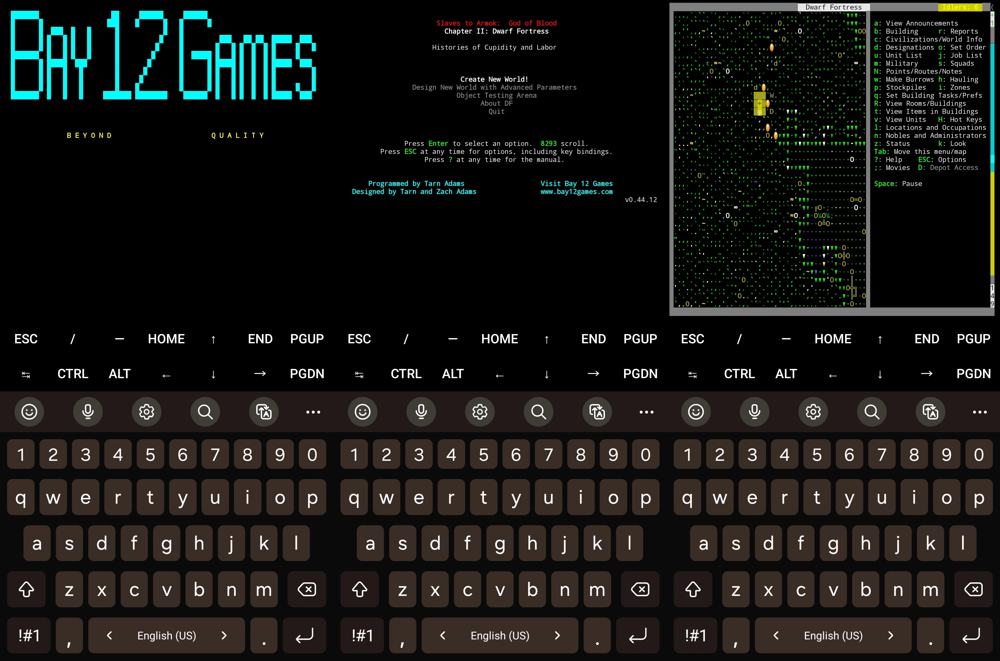

# Dwarf Fortress on Termux

A bash script that installs the ASCII Dwarf Fortress on Android devices using Termux!



## Installation

Commands are separated as I was not able to make them run together, for some reason the -y flag doesn't actually say yes to everything in pkg update.
```bash
pkg update && pkg install wget
```
```bash
curl -sSL https://raw.githubusercontent.com/lorenzo3421/Dwarf-Fortress-Termux/main/df-termux.sh | bash
```

After installation, you can run Dwarf Fortress by using the following command:
```bash
./df
```
You can pinch to zoom in and out in Termux, that will be very useful!

## Credits

[AllPlatform's Termux-UbuntuX86_64](https://github.com/AllPlatform/Termux-UbuntuX86_64)

## Contributing

Contributions are always welcome!

Please adhere to this project's
[Code of Conduct](.github/CODE_OF_CONDUCT.md).

## License

[MIT](https://choosealicense.com/licenses/mit/)
